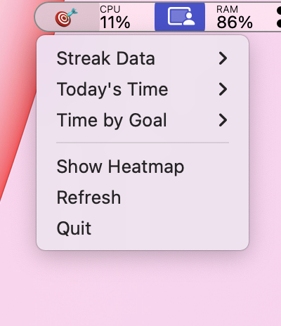
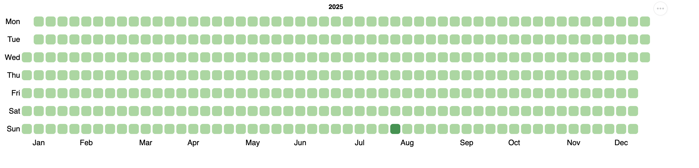

# Raycast Focus Session Tracker

A macOS menu bar application that tracks your Raycast focus sessions and displays productivity statistics with interactive heatmaps.

Monitor your focus patterns, build streaks, and visualize your productivity over time with a clean menu bar interface and GitHub-style calendar heatmaps.

## Installation

```bash
git clone <repository-url>
cd raycast-tracker
pip install -e .
```

## Usage

**Start:**
```bash
raycast-tracker
```

**Stop:**
```bash
raycast-tracker-stop
```

The app displays a 🎯 icon in your menu bar showing:
- Current and longest focus streaks
- Today's total focus time
- Time breakdown by goal
- Interactive GitHub-style heatmap

## Screenshots

### Menu Bar Dropdown


### Focus Heatmap


## Requirements

- macOS (required)
- Python 3.8+
- Raycast application with focus sessions

## Dependencies

- [rumps](https://github.com/jaredks/rumps) - macOS menu bar framework
- [lesley](https://github.com/astariul/lesley) - Calendar heatmap visualization  
- [pandas](https://pandas.pydata.org/) - Data processing